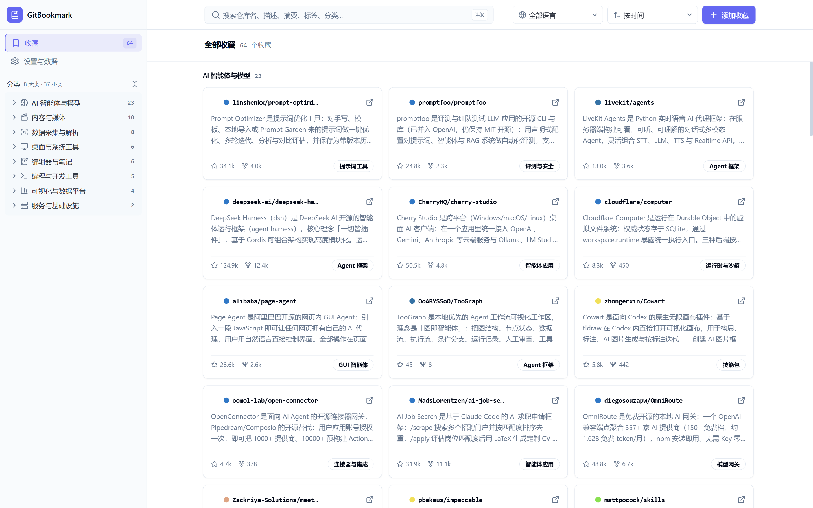
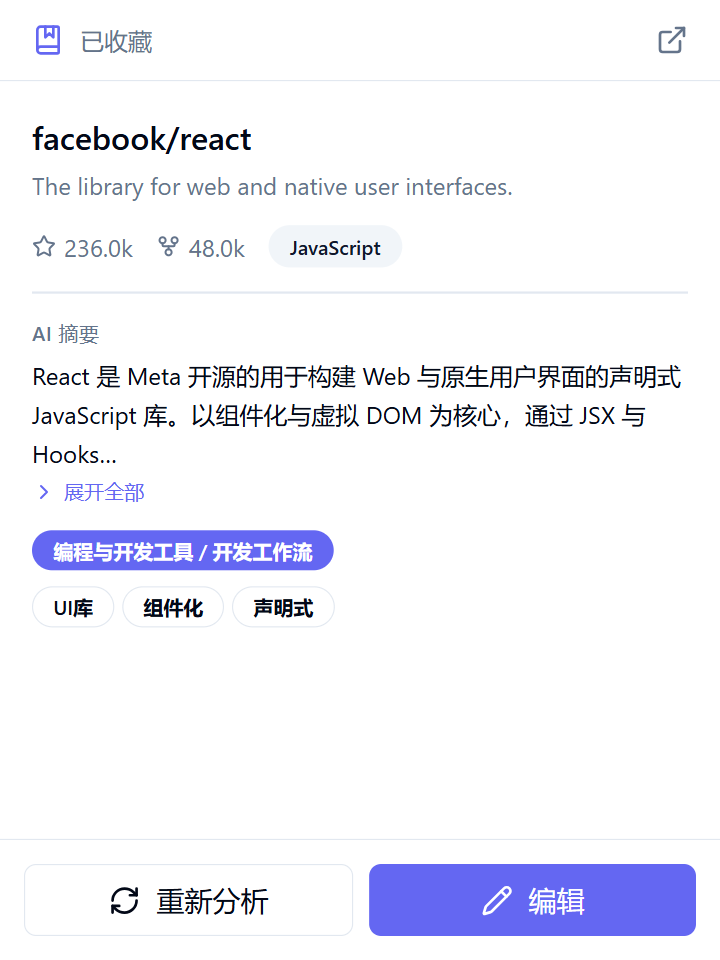
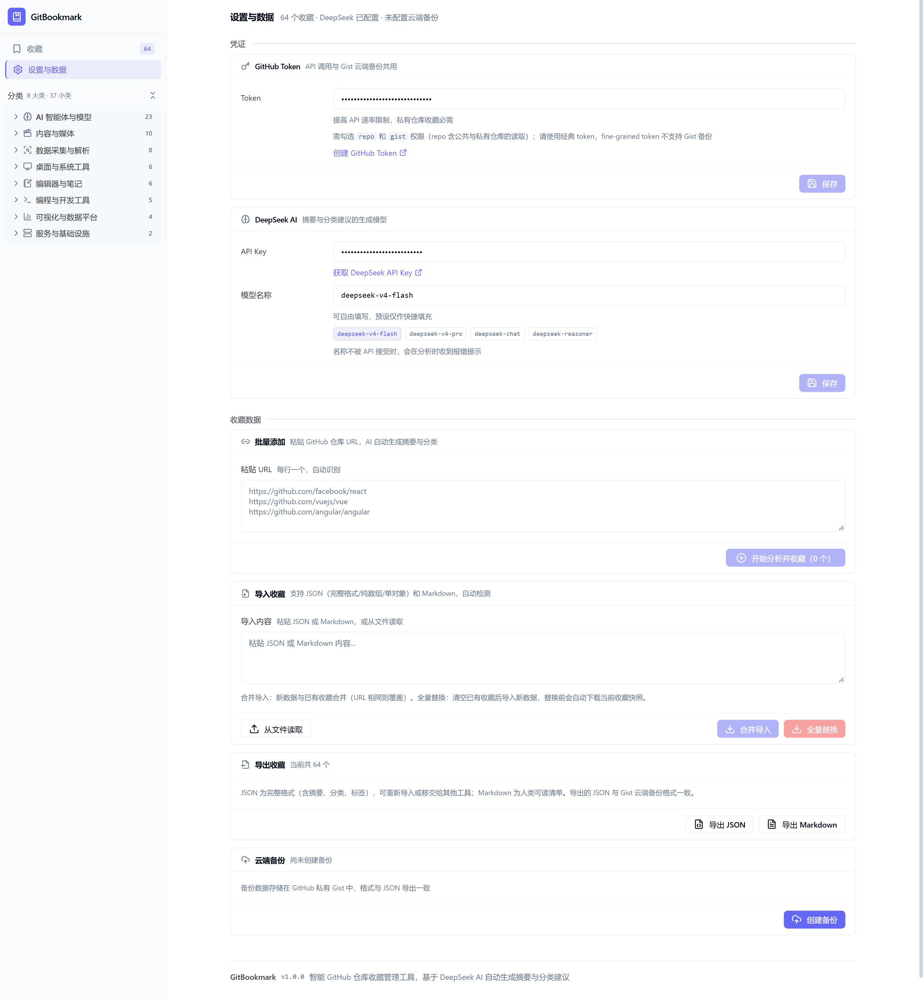

# GitBookmark

**收藏和管理 GitHub 仓库的 Chrome 扩展——AI 读 README，替你写下简体中文的摘要、分类与标签，让收藏列表长成一份你自己的技术选型笔记。**

*收藏页：固定两级分类体系（8 大类 37 小类）+ 侧栏分类树 + AI 摘要卡片*

---

## ✨ 功能

**分析并收藏当前仓库。** 在任意 `github.com/owner/repo` 页面点开扩展弹窗，GitBookmark 自动抓取仓库元数据与 README，交给 DeepSeek 生成摘要、分类与标签，确认后入库。已收藏的仓库再点开时直接展示详情；弹窗里的「编辑」会打开管理页并直达该条收藏的编辑弹窗。

**批量添加。** 管理页「设置与数据」的批量添加模块支持粘贴一段文本（README、issue、聊天记录皆可），GitBookmark 从中提取全部合法仓库链接，带并发上限地逐个分析。单次最多 100 个仓库，超出会要求分批；其中某个仓库失败不会中断整批，失败原因逐条回传展示。

**按分类浏览与再分析。** 「收藏」页按分类分组展示卡片，支持关键词搜索、分类/标签/语言筛选，以及按收藏时间、Star 数、仓库名排序。选中若干条可以批量删除，或让 AI 重新分析——重新分析失败的收藏保留原有数据不被覆盖。

**导入导出与云端备份。** 收藏列表可导出为 JSON 或 Markdown，导入时自动识别格式。「设置与数据」里还有云端备份模块：把收藏写进一个 GitHub 私有 Gist，换机器或重装浏览器后一键恢复。无论导入替换还是云端恢复，都会在覆盖前自动下载当前收藏快照。

 

<table>
  <tr>
    <td width="62%"></td>
    <td width="38%">«<b>设置与数据</b>»：凭证、批量添加、导入导出与云端备份集中在一页，模块级保存。  所有数据操作都自带兜底：导入自动识别格式，覆盖前自动下载快照。</td>
  </tr>
</table>

## 📦 安装

1. 安装依赖并构建：`npm install && npm run build`
2. 打开 `chrome://extensions`，开启右上角「开发者模式」
3. 点「加载已解压的扩展程序」，选择项目下的 `dist/` 目录

开发时用 `npm run dev` 启动 Vite（端口 5173，由 `@crxjs/vite-plugin` 提供扩展热更新）。`npm run test` 跑 Vitest 单元测试，`npm run lint` 跑 ESLint（TypeScript 推荐规则 + react-hooks 规则）；GitHub Actions 在 push 与 PR 时执行 lint、类型检查、测试三件套（`.github/workflows/ci.yml`）。

**权限说明。** 权限收敛为最小集：`storage` 存收藏与设置，`activeTab` 在你点击扩展图标时读取当前标签页的 GitHub URL（无需常驻读取所有标签页的 `tabs` 权限），`contextMenus` 提供右键入口。网络访问仅限 `api.github.com`、`api.deepseek.com`、`raw.githubusercontent.com` 三个域名，无内容注入、无遥测。

## ⚙️ 首次配置

扩展的所有配置与数据操作都集中在管理页的「设置与数据」里，模块级保存，即时生效。

**DeepSeek API Key**（必填）。填 `sk-` 开头的密钥。**模型名称**可自由填写——DeepSeek 模型会更新换代，输入框下方提供常用预设标签作快捷填充；名称不被 API 接受时会在分析时收到报错提示。未填密钥时任何分析动作都会被拒绝并提示。

**GitHub Token**（收藏私有仓库时必填）。GitBookmark 需要具有 `repo` 与 `gist` 权限的**经典 token**（fine-grained token 不支持 Gist），模块里有带正确 scope 预填的创建链接。Token 同时承担两件事：提高 GitHub API 速率上限，以及读写云端备份的 Gist。不配置 Token 也能用，但受 GitHub 未认证请求的速率限制，批量分析和云端备份都不可用，私有仓库无法收藏。

README 缺失、仓库被限流时，GitBookmark 不会中断流程：元数据照常获取，README 内容降级为空，AI 只依据项目描述与 Topics 分析。

## 🧩 工作原理

三个运行面各自负责一段，彼此只通过类型化的消息往来。

弹窗（`src/popup/`）读当前 Tab 的 URL，负责分析当前仓库并保存；管理页（`src/manage/`）是无路由库的单页应用，左侧栏承载导航与分类树，`bookmarks | config` 两块内容在右侧主区切换；后台 service worker（`src/background/index.ts`）是唯一持有数据的地方，一个 `handleMessage` 把 15 个 action 路由到 `src/lib/` 下的各模块。

前端调 `sendMessage(action, payload)`（`src/lib/messaging.ts`），action、payload、返回值三者的对应关系由 `src/lib/types.ts` 里的 `MessagePayloadMap` 与 `MessageReturnMap` 钉死，新增消息必须同时补这两张表，否则编译不过。消息超时以 180 秒为基线，足够覆盖单个仓库「GitHub 元数据 + DeepSeek 分析」的最坏耗时；批量分析与重新分析的消息按仓库数线性放大超时（规则见 `messaging.ts` 的 `timeoutFor`），避免大批量时后台仍在运行、界面先报超时。Chrome 在 MV3 下抛出的英文通信错误会被翻译成中文提示再交给界面。

分析一条收藏要依次经过 `src/lib/github.ts`（元数据与 README，README 会清掉 badge 与 HTML 注释并截取 2000 字符）和 `src/lib/deepseek.ts`（构造 prompt、提取并规范化 JSON 输出、把「前端框架」和「前端开发框架」这类近似分类归一）。批量场景由 `src/lib/concurrency.ts` 的 `mapWithLimit` 控制并发上限 6，语义等同 `Promise.allSettled`：返回数组与输入等长同序，单项失败只进失败清单。

存储层（`src/lib/storage.ts`）把收藏列表、设置与设置写入审计存在 `chrome.storage.local` 的三个键下。因为后台会并发处理多条消息，「读全量→改→写全量」交错时后完成者会拿旧快照覆盖先完成者的写入，所以所有写路径都过一层串行化队列。设置的唯一写入口是 `updateSettings(patch, source)`：调用方只提交变更字段，队列内完成读-合并-写，并记一条只含来源与字段名的写入审计（不含字段值，避免密钥落盘）。

导出与备份共用同一份数据结构 `BackupPayload`，因此本地导出的 JSON 与云端 Gist 里的备份可以互相通用；导入侧兼容完整包装对象、纯数组、单个收藏三种 JSON 形态，以及 Markdown 文件。

## 📐 项目约定

界面文案与代码注释一律简体中文，专有名词（Gist、README、Star、Fork、Popup、service worker）与代码标识符保留英文。

业务名词全项目只有一个写法：`Bookmark` 称「收藏」，三个分析动作分别叫「分析当前仓库」「批量分析」「重新分析」，`BatchFailure` 一律称「失败清单」。引用界面文案与中文概念用「」，引用代码标识符与字符串字面量保留英文原样。

注释不复述代码在做什么：区块分隔注释标明一段代码的职责，导出符号的 JSDoc 写清职责与契约（返回结构、副作用、失败语义），行内注释只保留权衡、陷阱，以及不看源码就推不出来的原因。同一条理由只写在最贴近实现的那一处，不在调用方重复一遍。

设置页组件把版式约定固化在 API 里：`Panel` 的底部操作区分 `secondary`（左辅助）与 `primary`（右主操作）两槽，头部不放按钮；`FieldRow` 的字段说明与控件列左对齐，窄标签列只放标签。六个模块共用同一套「右下主操作、左下辅助、说明跟控件」的落位规则。

## ⚠️ 已知限制

密钥与收藏都以明文存在 `chrome.storage.local`，扩展本身不经过任何第三方服务器，除 GitHub（含 `raw.githubusercontent.com`）与 DeepSeek 之外不发请求。

AI 的摘要质量取决于 README 的信息量：README 缺失或过于简略的仓库，摘要会明显偏薄，此时可以手动编辑，或在「收藏」页选中后让 AI 重新分析。分类来自代码里维护的固定两级体系（`src/lib/deepseek.ts` 的 `CATEGORY_TAXONOMY`，8 个大类、37 个小类），AI 只能在体系内选择、不能新建；调整分类只需改这一张表。

批量分析上限 100 个仓库、并发上限 6，是冲着避免 GitHub 与 DeepSeek 限流去的；被限流时失败项会列在界面上，重新执行一次即可补齐。

## 🤝 贡献

Issue 与 PR 均欢迎。开发环境按「安装」一节搭建即可；提交前请确保 `npm test`、`npm run lint`、`npx tsc --noEmit` 全部通过（CI 执行同样的三件套）。AI 辅助开发的架构约束与禁区见 [AGENTS.md](AGENTS.md)。

## 📄 License

[MIT](LICENSE)。
